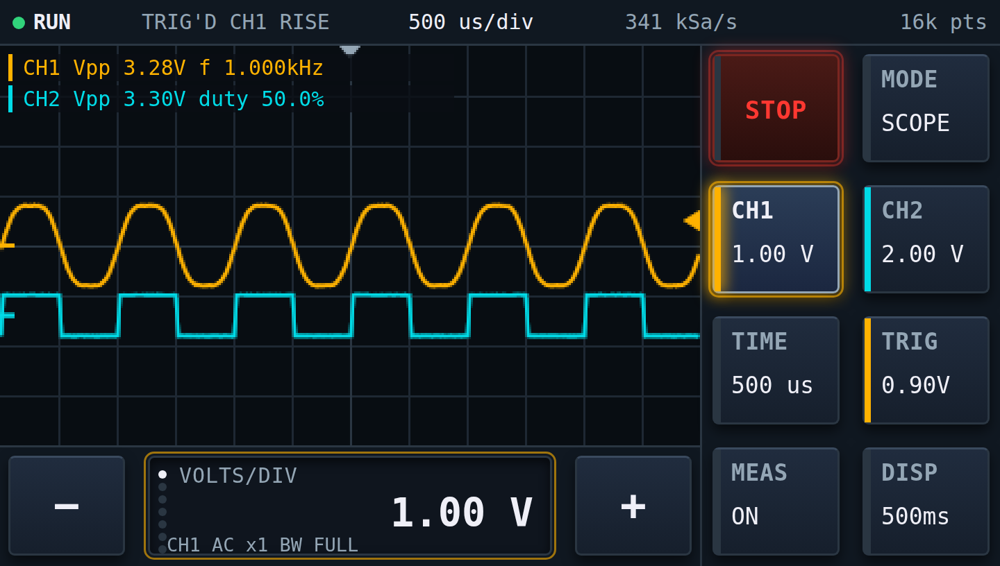
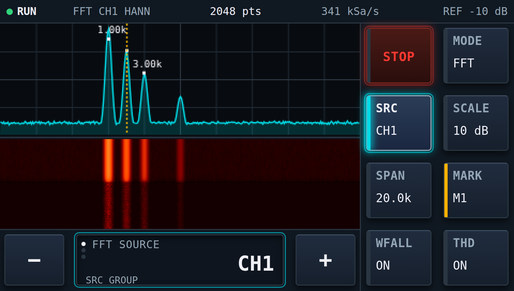
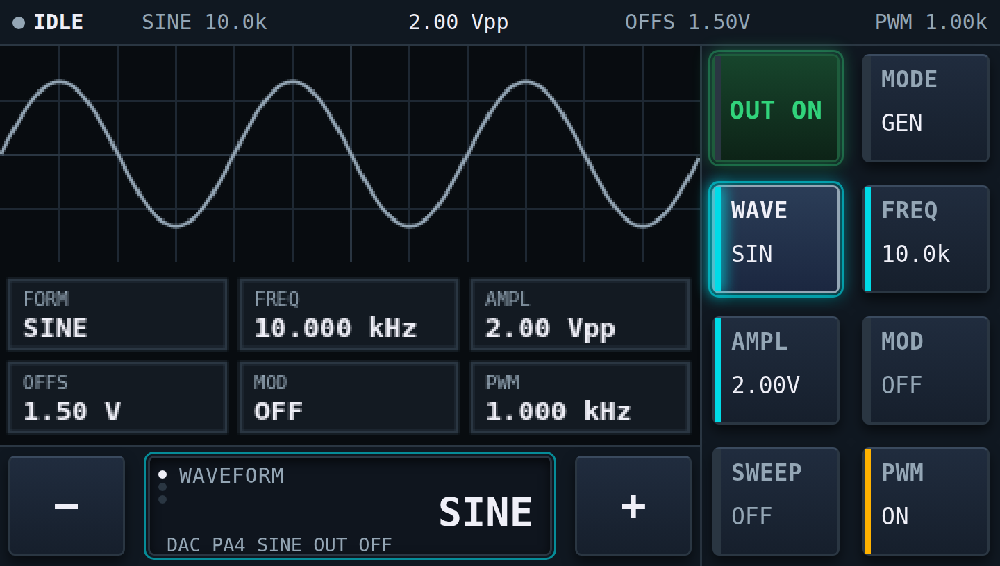
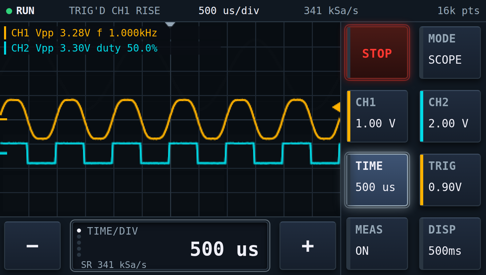

# DSO-746

Цифровой осциллограф, анализатор спектра и генератор сигналов на одной отладочной
плате. Три режима на одном экране, управление полностью сенсорное.

**Плата: STM32F746G-DISCO** (STM32F746NG, Cortex-M7 216 МГц, экран 4.3" 480×272,
ёмкостный тач FT5336, 8 МБ SDRAM). Внешних деталей не требуется.

> **Проект в разработке.** Демонстрационный режим работает полностью и именно он
> показан на снимках ниже. Боевой режим — реальный сбор с АЦП — реализован, но
> обкатан не полностью: часть функций проверена только расчётом и хостовыми
> тестами. Подробности в разделе [Текущее состояние](#текущее-состояние).

---

> Полная справочная страница с таблицей характеристик и всеми режимами: **[docs/REFERENCE.md](docs/REFERENCE.md)**.

## Интерфейс

### Осциллограф



Два канала, послесвечение с настраиваемым временем затухания, автоматические
измерения, маркеры уровня запуска и нуля каналов, сетка 12×8 делений.

### Анализатор спектра



БПФ до 4096 точек, пять оконных функций, поиск пиков, водопад с тремя палитрами,
выбор полосы обзора.

### Генератор



Предпросмотр формы, карточки текущих параметров, включение выхода удержанием
клавиши 600 мс, индикация ограничения выхода.

### Фосфорная подсветка клавиш



Нажатая клавиша разгорается мгновенно и гаснет за 260 мс — это штатный механизм
переходов стиля LVGL, а не покадровая анимация. Ореол горит только на активной
клавише и на RUN: тень в LVGL считается программно и не ускоряется DMA2D.

Все снимки сделаны с интерактивного макета интерфейса `docs/ui-mockup.html`,
который выполнен один в один с прошивкой: та же геометрия в пикселях и та же
палитра, уже квантованная в RGB565. Макет открывается в любом браузере, кликается
и служит для проверки вёрстки без платы.

---

## Как пользоваться

### Сборка

```
west build -b stm32f746g_disco -p always .
```

Overlay из каталога `boards` подхватывается по имени платы автоматически.

### Загрузка

Плата содержит ST-LINK/V2-1, отдельный программатор не нужен.

1. Подключить кабель к разъёму **CN14 (ST-LINK)**.
2. В системе появится диск **DIS_F746NG**.
3. Скопировать на него `build/zephyr/zephyr.bin` — плата прошьётся и
   перезапустится сама.

Альтернативно `west flash` (нужен STM32CubeProgrammer в PATH) или готовый
`.hex` из [Releases](../../releases). Консоль Zephyr — на том же кабеле,
виртуальный COM-порт, 115200 8N1.

Если копирование на диск молча не срабатывает, обновите прошивку самого ST-LINK
и выберите вариант **Debug + Mass Storage + VCP** — без Mass Storage диск не
появляется. Внутренняя флэш 1 МБ, образ занимает 44 %.

### Боевой режим (LIVE)

Поведение прибора задано спецификацией **docs/UI-SPEC.md** (на английском);
код пишется под неё. Кратко:

Клавиша **B1 USER** переключает DEMO ↔ LIVE. Интерфейс и логика в обоих
режимах **одни и те же** — отличается только источник отсчётов: симулятор
или АЦП. Клавиша группы открывает
панель параметров поверх луча — 3×3 плитки, последняя BACK. Касание плитки:

- **список** (связь, щуп, фронт, режим запуска, окно, форма сигнала и т.п.) —
  панель показывает страницу вариантов, по плитке на вариант; касание варианта
  применяет его сразу и возвращает на страницу параметров;
- **шаговое значение** (вольты и время на деление, смещение, уровень запуска,
  частота, амплитуда) — панель сворачивается, луч виден, клавиши − и + и
  перетаскивание по экрану меняют значение с живым обновлением луча; клавиша
  группы возвращает страницу;
- **частота** (генератор, ШИМ) — цифровая клавиатура: набираете число, оно
  видно в поле значения, затем жмёте множитель Hz, kHz или MHz — он же
  применяет значение после проверки допустимости (выход за диапазон
  обрезается до границы), панель сворачивается, луч виден, клавишами − и +
  можно подстроить;
- **ВКЛ/ВЫКЛ** — переключается на месте; **AUTOSET** — выполняется сразу.

Перетаскивание по лучу: по вертикали — смещение выбранного канала или уровень
запуска при выбранной группе TRIG, по горизонтали — положение развёртки.

Любая панель закрывается клавишей BACK, той же клавишей группы, RUN, MODE,
переключением демо/боевой и через 10 с без касаний. Все значения проходят
единую проверку допустимости; недопустимую комбинацию ввести нельзя
(например амплитуда и смещение генератора вместе всегда умещаются в 0…3.3 В).
STOP замораживает последний кадр, и органы управления продолжают его
перерисовывать. Если в боевом режиме нет данных, статус показывает NO DATA
или WAIT TRIG, интерфейс при этом не останавливается.

Технические характеристики и их расчёт — в **SPECS.md**.


### Управление

Прибор **всегда стартует в демонстрационном режиме**: сигналы синтезируются,
к входам ничего подключать не нужно. В статусной строке горит **DEMO** и надпись
SIMULATED SIGNAL.

Переключение демонстрационного и боевого режимов — **синяя кнопка B1 USER на
обратной стороне платы**, со стороны монтажа, рядом с чёрной кнопкой сброса B2
RESET. В документации ST она обозначена как USER & WAKE-UP Button и заведена на
вывод PI11. Нажатие переключает режим в обе стороны, экран при этом очищается,
чтобы картинка из другого источника не осталась на экране.

| Орган | Действие |
|---|---|
| **B1 USER** (кнопка на обратной стороне платы) | демонстрационный режим ↔ боевой |
| **MODE** | циклически SCOPE → FFT → GEN |
| **RUN / STOP** | пуск и остановка; в режиме генератора — включение выхода удержанием 600 мс |
| Клавиши групп | выбор группы параметров; в боевом режиме открывают всплывающую панель настроек |
| Поле значения | перелистывает параметры внутри группы, точки слева показывают позицию |
| **−** и **+** | изменяют выбранный параметр, удержание даёт автоповтор |

Правило клавиш **−** и **+** одно и без исключений: **плюс всегда увеличивает
то, что видно на экране**. Для смещения, уровня запуска и амплитуды это совпадает
с ростом числа; для вольт на деление и времени на деление плюс шагает лестницу
вниз, потому что именно так луч становится крупнее.

### Входы и выходы

| Сигнал | Вывод | Разъём |
|---|---|---|
| Канал 1 | PA0 | Arduino A0 |
| Канал 2 | PF10 | Arduino A1 |
| Выход генератора (ШИМ-ЦАП) | PB4 | Arduino D3 |
| Калибратор / жёсткий меандр | PH6 | Arduino D6 |
| Внешний запуск (задел) | PG6 | Arduino D2 |

Вход принимает **0…3.3 В** — аналогового тракта на плате нет. Прошивка написана
так, что подключение внешнего делителя со смещением меняет только константы
калибровки.

---

## Как это работает

Полное описание архитектуры от вывода до пикселя — в
[docs/architecture.md](docs/architecture.md), расчётные характеристики — в
[SPECS.md](SPECS.md).

**Сбор.** TIM2 своим событием TRGO запускает ADC1 (канал 1) и ADC3 (канал 2)
одновременно, поэтому каналы синхронны с точностью до такта ADCCLK. Данные идут
кольцевым DMA с прерываниями по половине и по концу буфера. Кольцо живёт во
внутренней SRAM и вне кэша: LTDC непрерывно читает кадр из SDRAM, и второй поток
туда же отнял бы у него полосу FMC, а D-cache процессора DMA не видит.

**Запуск** программный, по фронту, с гистерезисом и перевзводом: взводимся только
после ухода сигнала за пределы зоны гистерезиса, поэтому один шумный переход не
даёт серию ложных срабатываний. Гистерезис, удержание и частота дискретизации
вынесены в меню.

**Отрисовка луча** идёт мимо виджетов. Отсчёты сводятся к 336 парам min/max — по
одной на пиксельный столбец, так одиночный выброс не теряется при прореживании.
Пары пишутся в карту интенсивности 8 бит на канал; послесвечение — это вычитание
константы из всей карты раз в кадр, после чего карты сводятся в холст RGB565
через цветовую рампу канала.

**Разделение нагрузки.** LVGL опрашивается каждые 10 мс — это даёт отклик на
касание около 40 мс, — а осциллограмма пересчитывается раз в 50 мс. Ни один
виджет не переписывается, если его значение не изменилось, поэтому на спокойной
панели перерисовывается только прямоугольник луча. Заливки и переносы выполняет
аппаратный ускоритель Chrom-ART (DMA2D) по прерыванию завершения.

---

## Программный стек

| Слой | Что использовано |
|---|---|
| ОС | **Zephyr RTOS** (main, 4.4.99): потоки, слэб памяти, очереди, семафоры, мьютексы, разметка некэшируемой области через MPU |
| Сборка | west, CMake, Kconfig, devicetree; **Zephyr SDK 1.0.1**, arm-zephyr-eabi GCC 14.3.0, picolibc |
| Графика | **LVGL 9** через штатный модуль Zephyr; блок отрисовки на **DMA2D (Chrom-ART)** по прерыванию |
| ЦОС | **CMSIS-DSP**: `arm_rfft_fast_f32`, вычисление модуля спектра на аппаратном FPU |
| Драйверы | LTDC (экран), FT5336 через подсистему input (тач), I2C, gpio-keys (клавиша B1), подсистема логирования |
| Периферия | **STM32Cube LL** напрямую для АЦП, таймеров, DMA и выводов |

Обращение к LL — сознательное исключение: штатный драйвер АЦП в Zephyr умеет
только одиночное чтение и не даёт непрерывного кольцевого DMA, без которого
осциллографа не бывает. Соответствующие узлы отключены в devicetree, чтобы
драйверы не конфликтовали за потоки DMA и прерывания.

### Проверка без платы

Алгоритмическое ядро — поиск запуска, предзапуск с заворотом кольца, сведение
min/max, измерения, планировщик развёртки — вынесено в файлы без единого
обращения к железу и собирается обычным компилятором на хосте:

```
cd tests/host
cc -I../../src -O2 -Wall -Wextra test_algo.c ../../src/acq_algo.c \
   ../../src/dsp_math.c -lm -o test_algo && ./test_algo
```

Тест проверяет, что при 500 мкс/дел на экран укладывается ровно 6 периодов
сигнала 1 кГц, что одиночный выброс переживает прореживание, что самая быстрая
развёртка физически достижима, и что гистерезис действительно лечит ложные
запуски: на медленной зашумлённой синусоиде без него получается 33 срабатывания
там, где должно быть 4.

---

## Структура

```
src/acq.c        TIM2 + ADC1/ADC3 + кольцевой DMA2, поток поиска запуска
src/acq_algo.c   триггер, предзапуск, min/max, планировщик развёртки, лестницы
src/dsp.c        окна и БПФ через CMSIS-DSP
src/dsp_math.c   автоизмерения Vpp, Vrms, частота, скважность
src/gen.c        ШИМ-ЦАП на PB4 и калибратор на PH6
src/sim.c        генератор сигналов демонстрационного режима
src/ui.c         LVGL: панель клавиш, всплывающие настройки, отрисовка трёх режимов
src/main.c       инициализация, две дорожки обновления интерфейса
boards/          overlay платы
docs/            архитектура и интерактивный макет интерфейса
tests/host/      тесты алгоритмов, собираются на хосте
```

---

## Текущее состояние

**Работает и проверено на плате:** демонстрационный режим во всех трёх экранах,
сенсорное управление, фосфорная подсветка, всплывающие панели настроек,
переключение демо/боевой клавишей B1, загрузка через диск ST-LINK.

**Проверено расчётом и хостовыми тестами:** алгоритмы сбора и измерений,
планировщик развёртки, карта выводов по UM1907, номера потоков DMA по RM0385.

**Не доведено:**

- Боевой режим на реальных сигналах обкатан не полностью.
- Чередование АЦП не реализовано, поэтому развёртка ограничена 20 мкс/дел;
  одноканальный режим на 5.4 MSa/s остаётся заделом.
- Спектр ШИМ-ЦАП с внешним RC-фильтром не измерялся.
- Совместная нагрузка LTDC и DMA на шину FMC при быстрых развёртках не мерялась.
- Ширина полей крупных значений рассчитана для моноширинного шрифта, а крупные
  значения выводятся шрифтом Montserrat с более широкими цифрами.
- Аналоговый тракт (защита, делитель, смещение, AC/DC) не изготавливался; вход
  работает в диапазоне 0…3.3 В.

---

## Лицензия

MIT, см. [LICENSE](LICENSE).
